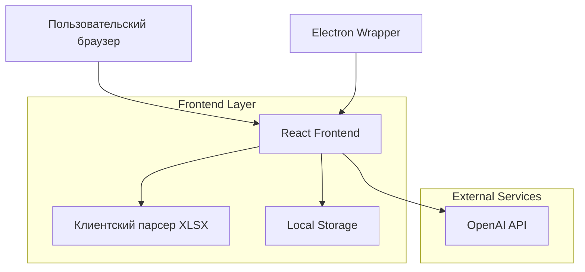
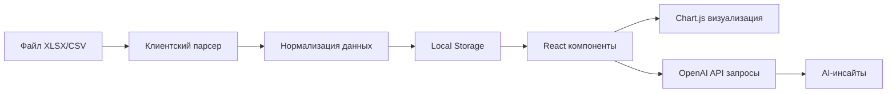

## 1. Архитектура системы



## 2. Технологический стек

- **Frontend**: React@18 + Vite + TypeScript
- **Стили**: TailwindCSS@3 с кастомной конфигурацией iOS Glassmorphism
- **Парсинг**: SheetJS (xlsx) для клиентской обработки файлов
- **Графики**: Chart.js + react-chartjs-2
- **AI-анализ**: OpenAI API (прямое обращение с клиента)
- **Состояние**: React Context + useReducer
- **UI-компоненты**: Headless UI + Framer Motion (анимации)
- **Инициализация**: vite-init

## 3. Определение маршрутов

| Маршрут | Назначение |
|---------|------------|
| / | Главная страница с загрузкой файлов |
| /dashboard | Дашборд качества с визуализациями |
| /preview | Предпросмотр загруженных данных |

## 4. Поток данных



## 5. Архитектура компонентов

### 5.1 Структура React-приложения
```
src/
├── components/
│   ├── FileUpload/
│   │   ├── FileDropZone.tsx
│   │   ├── FilePreview.tsx
│   │   └── DataValidator.ts
│   ├── Dashboard/
│   │   ├── ParetoChart.tsx
│   │   ├── TrendChart.tsx
│   │   ├── KPICards.tsx
│   │   └── InsightsPanel.tsx
│   ├── Filters/
│   │   ├── DateFilter.tsx
│   │   ├── SupplierFilter.tsx
│   │   └── DefectFilter.tsx
│   └── UI/
│       ├── GlassCard.tsx
│       ├── IOSButton.tsx
│       └── AnimatedContainer.tsx
├── hooks/
│   ├── useDataParser.ts
│   ├── useAIInsights.ts
│   └── useLocalStorage.ts
├── utils/
│   ├── dataProcessor.ts
│   ├── paretoCalculator.ts
│   └── statistics.ts
└── types/
    ├── data.types.ts
    └── chart.types.ts
```

### 5.2 Обработка данных
Основные типы данных:

```typescript
interface DefectRecord {
  id: string;
  nomenclature: string;
  personalNumber: string;
  claimReason: string;
  defectDescription: string;
  supplier: string;
  date: Date;
  quantity: number;
}

interface ParetoItem {
  reason: string;
  count: number;
  percentage: number;
  cumulativePercentage: number;
}

interface SupplierKPI {
  supplier: string;
  totalDefects: number;
  defectPercentage: number;
  trend: 'up' | 'down' | 'stable';
}
```

## 6. Клиентская архитектура

### 6.1 Парсинг файлов
- Использование SheetJS для чтения XLSX/CSV файлов в браузере
- Валидация структуры файла (обязательные поля)
- Ограничение размера файла (10MB максимум)
- Построчная обработка для больших файлов

### 6.2 Хранение данных
- LocalStorage для кэширования загруженных данных
- IndexedDB для больших объемов данных (>5MB)
- Сессионное хранилище для текущих фильтров

### 6.3 AI-анализ
- Прямое обращение к OpenAI API с клиента
- Кэширование результатов для одинаковых запросов
- Обработка ошибок и таймаутов
- Лимиты запросов (rate limiting)

## 7. UI-архитектура

### 7.1 Glassmorphism реализация
```css
.glass-card {
  background: rgba(255, 255, 255, 0.25);
  backdrop-filter: blur(10px);
  border: 1px solid rgba(255, 255, 255, 0.18);
  border-radius: 12px;
  box-shadow: 0 8px 32px 0 rgba(31, 38, 135, 0.37);
}
```

### 7.2 Анимации и переходы
- Framer Motion для плавных переходов между страницами
- Spring-анимации для интерактивных элементов
- Параллакс эффекты для графиков

## 8. Подготовка к Electron

### 8.1 Структура Electron-приложения (будущее)
```
electron/
├── main.ts          // Главный процесс
├── preload.ts       // Preload скрипты
└── ipc/            // IPC обработчики
    ├── fileHandler.ts
    └── printHandler.ts
```

### 8.2 Нативные возможности
- Чтение файлов через диалог выбора
- Экспорт отчетов в PDF
- Системные уведомления
- Авто-обновления

## 9. Безопасность и производительность

### 9.1 Оптимизация
- Виртуализация списков для больших datasets
- Memoизация вычислений (useMemo)
- Lazy loading для графиков
- Debounce для фильтров

### 9.2 Безопасность
- Sanitization данных перед отображением
- CSP заголовки для Electron
- Валидация всех внешних данных
- Rate limiting для API запросов

## 10. Масштабируемость

### 10.1 Модульная архитектура
- Независимые модули компонентов
- Плагинная система для новых типов визуализаций
- Абстракция для различных источников данных

### 10.2 Расширение функциональности
- Добавление новых типов графиков
- Интеграция с внешними API
- Кастомные метрики и KPI
- Пользовательские дашборды