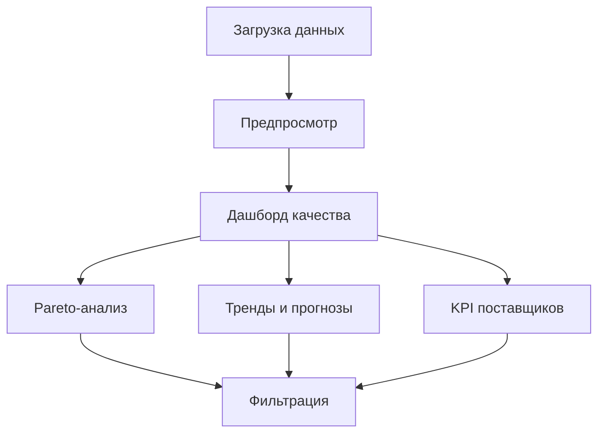

## 1. Обзор продукта
Quality Dashboard V1 — это веб-приложение для анализа качества продукции на основе данных о дефектах. Система позволяет загружать файлы с данными о дефектах, проводить их нормализацию и визуализировать ключевые метрики качества с фокусом на причины дефектов.

Продукт решает задачу быстрого понимания основных причин брака и помогает принимать управленческие решения по улучшению качества. Целевая аудитория — менеджеры по качеству и аналитики.

## 2. Основные функции

### 2.1 Роли пользователей
| Роль | Способ регистрации | Основные права |
|------|-------------------|----------------|
| Аналитик качества | Локальная авторизация | Загрузка файлов, просмотр дашбордов, экспорт отчетов |
| Менеджер качества | Локальная авторизация | Все функции аналитика + подтверждение нормализации |

### 2.2 Модули функциональности
Основные страницы приложения:
1. **Загрузка данных**: Интерфейс для загрузки файлов XLSX/CSV/TXT с данными о дефектах.
2. **Дашборд качества**: Визуализация ключевых метрик с фокусом на причины дефектов (Pareto-анализ).
3. **Нормализация дефектов**: Подтверждение автоматически предложенных группировок дефектов (V2).

### 2.3 Детализация страниц
| Название страницы | Модуль | Описание функциональности |
|-------------------|---------|---------------------------|
| Загрузка данных | Загрузчик файлов | Поддержка drag-anddrop, валидация форматов XLSX/CSV/TXT, отображение прогресса загрузки |
| Загрузка данных | Предпросмотр данных | Табличный просмотр первых 100 строк, отображение полей: Номенклатура, Персональный номер, Причина претензии, Описание дефекта, Поставщик |
| Дашборд качества | Pareto-анализ причин | Горизонтальная столбчатая диаграмма с накопительным процентом, топ-10 причин дефектов |
| Дашборд качества | Статистические наблюдения | Автоматически сгенерированные инсайты на основе данных, текстовые карточки с ключевыми фактами |
| Дашборд качества | Тренды и прогнозирование | Линейный график динамики дефектов по времени, прогноз на следующий период |
| Дашборд качества | KPI поставщиков | Таблица с процентом дефектов по поставщикам, сортировка по убыванию |
| Дашборд качества | Фильтры | Интерактивные фильтры по дате, поставщику, номенклатуре, причине дефекта |

## 3. Основные процессы

### Поток аналитика качества
1. Пользователь заходит на страницу загрузки данных
2. Загружает файл с данными о дефектах через drag-and-drop или кнопку выбора
3. Система валидирует файл и показывает предпросмотр данных
4. Пользователь подтверждает корректность данных и переходит к анализу
5. На дашборде пользователь видит Pareto-анализ причин, тренды и KPI
6. При необходимости применяет фильтры для детального анализа

## 4. Пользовательский интерфейс

### 4.1 Стиль дизайна
- **Цветовая палитра**: Основной — системный синий iOS (#007AFF), вторичный — светло-серый (#F2F2F7), фон — полупрозрачный белый с размытием
- **Стиль кнопок**: Круглые кнопки с тенью, glassmorphism эффект, размер 44px минимум
- **Типографика**: SF Pro Display, размеры: заголовки 28-34px, текст 17px, мелкий текст 13px
- **Компоновка**: Card-based дизайн с закругленными углами (12px), большие отступы (16-24px)
- **Иконки**: SF Symbols стиль, линейные иконки, толщина 2px

### 4.2 Обзор страниц
| Название страницы | Модуль | UI элементы |
|-------------------|---------|-------------|
| Загрузка данных | Зона загрузки | Полупрозрачная карточка с пунктирной границей, иконка облака, кнопка "Выбрать файл" |
| Загрузка данных | Таблица предпросмотра | Glassmorphism таблица с полосами, закругленные углы, системный скролл |
| Дашборд качества | Pareto-график | Горизонтальные столбцы с градиентом, накопительная линия, подписи с правой стороны |
| Дашборд качества | Карточки инсайтов | Полупрозрачные карточки с иконкой, заголовком и описанием, анимация появления |
| Дашборд качества | График трендов | Линейный график с градиентной заливкой под линией, точки данных с подсветкой |

### 4.3 Адаптивность
Desktop-first подход с адаптацией для планшетов. Минимальная ширина 1024px. Touch-оптимизация для будущего Electron-приложения.

## 5. Область V1 vs V2

### V1 (Текущая реализация)
- Загрузка и парсинг файлов на клиенте
- Pareto-анализ причин дефектов
- Базовые статистические наблюдения
- Тренды по дате загрузки
- KPI поставщиков
- Фильтрация данных

### V2 (Будущие улучшения)
- Модальное окно предпросмотра нормализации с подтверждением
- Расширенный AI-анализ с рекомендациями
- Экспорт отчетов в PDF/XLSX
- Сравнение периодов
- Настраиваемые дашборды
- Интеграция с внешними системами